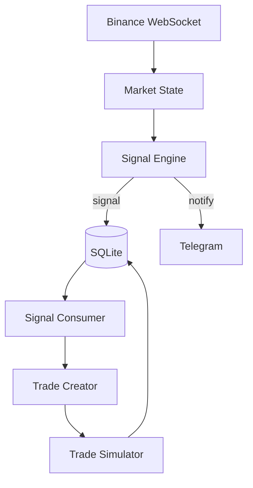

# 🚀 Crypto Momentum Signal & Trade Simulator

A modular, end‑to‑end **crypto market signal → trade simulation system** built in Python.

This project connects to **Binance Futures WebSocket**, detects momentum‑based trading signals, converts them into simulated trades, tracks performance, and optionally sends **Telegram notifications**.


---

## ✨ Key Features

* 📡 Real‑time Binance Futures WebSocket feed
* 📊 Momentum‑based signal engine (configurable)
* 🔁 Signal → Trade pipeline (exactly one trade per signal)
* 🧪 Trade simulator (TP / SL / time‑based exits)
* 🗃️ SQLite storage (signals + trades)
* 📬 Telegram notifications for trade suggestions
* 🧩 Pluggable strategy logic (easy to extend)
* 🧠 Analytics‑ready data model

---

## 🧠 Architecture Overview



---

## 📁 Project Structure

```
myproject01/
├── analytics/           # notebooks & analysis (future)
├── data_feed/           # Binance WS + market state
├── notifier/            # Telegram integration
├── signals/             # Signal engines & filters
├── storage/             # DB models & queries
├── trades/              # Trade creation & simulation
├── utils/               # env / helpers
├── config.py            # Strategy & system config
├── main.py              # App entrypoint
├── requirements.txt     # Dependencies
├── .env.example         # Environment variable template
├── .gitignore
└── README.md
```

---

## ⚙️ Configuration

All strategy behavior is controlled via **`config.py`**.

Key parameters:

```python
# Momentum signal parameters
MOMENTUM_PCT = 0.02        # 2% move threshold
LOOKBACK_SECONDS = 120     # price lookback window
COOLDOWN_SECONDS = 300     # per‑symbol cooldown

# Trade simulation
ENTRY_DELAY_SECONDS = 5
TAKE_PROFIT_PCT = 0.02
STOP_LOSS_PCT = 0.01
TIME_STOP_SECONDS = 90
```

Symbols are also configurable:

```python
SYMBOLS = [
    "BTCUSDT", "ETHUSDT", "SOLUSDT", "AVAXUSDT",
    "DOGEUSDT", "PEPEUSDT", "TIAUSDT", "BLURUSDT",
]
```

---

## 🔔 Telegram Notifications

The system can notify you when a **trade is suggested**.

### Setup

1. Copy the env template:

```bash
cp .env.example .env
```

2. Fill in your values:

```env
TELEGRAM_ENABLED=true
TELEGRAM_BOT_TOKEN=PASTE_TOKEN_HERE
TELEGRAM_CHAT_ID=PASTE_CHAT_ID_HERE
```

3. Signals will be sent automatically if enabled.

> ⚠️ **Never commit real tokens** — `.env` is ignored by git.

---

## ▶️ Running Locally

### 1. Create virtual environment (recommended)

```bash
python3 -m venv .venv
source .venv/bin/activate
```

### 2. Install dependencies

```bash
pip install -r requirements.txt
```

### 3. Run the app

```bash
.venv/bin/python main.py
```

You should see:

```
Initializing database...
Database initialized.
Connecting to Binance WebSocket...
SignalEngine started.
SignalConsumer started.
Trade simulator started.
```

---

## 🧪 Strategy Logic

Currently implemented:

* **Pure momentum strategy**

  * Long if price ↑ above threshold
  * Short if price ↓ below threshold

A **generic trade‑creation layer** is already in place, meaning:

> 🔁 You can change *how trades are created* **without touching the rest of the system**.

Examples of future logic:

* mean‑reversion (fade strong moves)
* SMA / EMA trend filters
* volume‑confirmed breakouts
* regime‑based strategies

---

## 📊 Analytics & Data

All signals and trades are stored in SQLite:

* `signals` table — raw signal events
* `trades` table — simulated execution & PnL

You can export data easily:

```bash
sqlite3 momentum.db ".headers on" ".mode csv" "select * from trades;" > trades.csv
```

Perfect for:

* Jupyter notebooks
* Pandas analysis
* Strategy evaluation

---

## 🗺️ Roadmap Ideas

* 📈 SMA / EMA trend filters
* 📊 Post‑trade analytics module
* 🧠 Strategy comparison framework
* 🔄 Multiple strategies sharing same data feed
* 🧪 A/B testing via Telegram notifications
* 📉 Drawdown & risk metrics

---

## ⚠️ Disclaimer

This project is **for educational and research purposes only**.

* No real trading is performed
* No financial advice
* Use at your own risk

---

## ⭐ Final Note

This repository is intentionally designed as a **clean, extensible foundation**.

You are encouraged to:

* fork it
* modify strategy logic
* experiment freely

Happy hacking 🚀
